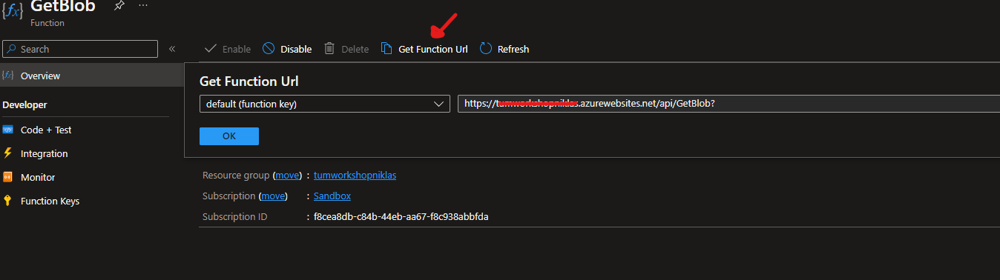

# Introduction

In this workshop you will gain some insights about cloud native architectures and cloud native security principles. By cloud native architectures, we refer to constructs that were not possible in a typical on-premise environment. Things like serverless (think Lambda functions or Azure functions) architectures, on-demand scaling, and Platform as service solution are what makes developing and deploying on the cloud very unqiue. These constructs however, are usually coupled with a change in security. Security principles of least privilige, confidentiality, etc remain the same, but the scope and method in which they are applied significantly change.

In this sample, we will show you how to deploy Azure Resources using [Terraform](https://terraform.io) to build a very simple cloud native application. This application is by intention kept simple, so that you can focus on understanding the main concepts rather than get lost in the little details.

The application is a simple piece of code that fetches pictures stored in the cloud. The application can be triggered by calling it in the browser with the name of the picture sent as a query parameter. 

In concrete Azure terms, the application will deploy an `Azure Function` (a serverless application) that will listen to HTTP requests on a specific URL. When a request is received, the function is triggered and it will read the contents of the picture (as sent in the request) stored in an `Azure Storage Account` and then will return the contents as a response to the request.


Like we just said: VERY SIMPLE!

The cloud native approach to the application goes beyond the architecture into the security. In the classical way of doing things, if the storage account is protected, a secret needs to be created and stored in the function code in order for the function to authenticate itself with the storage account for data access. But you will see later how using cloud managed identities, there is no need to bother ourselves with secrets.

## Running the project

The project already comes with a pipeline that automatically deploys everything for you with one single click! EVERYTHING from infrastructure, to code to actual application data is done with a single click! That's yet another reason why cloud is so attractive.

When you are ready, you can go ahead and click that pipeline to start. For the first ever pipeline run, it will take anywhere between 5 and 10 minutes to provision all the infrastructure and deploy the code. Future runs will be much faster depending on how much changes take place.


### Function Identities

In the past, creating a solution like this would mean adding a `MyStorageConnectionString` application setting to your Azure Function which would contain the primary or secondary connection string of the target storage account. However you'll notice, if you observe the Function App you just deployed to Azure, there is no such connection string:


> Note: The one connection string you _do_ see here is for the backend storage of your Azure Function, where its .zip package is uploaded when you publish

This is because the permission and connectivity to the target storage account is controlled by the Identity and RBAC assignments in your associated Active Directory. You can see the identity of your Function by going to its 'Identity' in the Azure portal.


If you click the `Azure role assignments` button, you'll even see its assignment and permissions to the storage account.

In the past, when we used Connection Strings, it gave the Function app *total control* over the storage account. Using RBAC allows finer-grained control over what the Function App can do. Additionally, if we roll the keys on the storage account, we need not restart the Function App to start using the new keys as we would in the past (as we'd have had to update the connection string or the value in KeyVault if using a KeyVault App Setting reference).

### Execute the Function

#### Nature Pictures

In your favorite browser, type the following URL

```shell
https://fxnxxxxxx.azurewebsites.net/api/GetBlob?blobUri=myfile
```

Where the URL is your unique function app trigger endpoint, which you can get from the portal here:



be sure to replace the "my.file" with a valid file that actually exists in the storage account. Hint: browse the repository contents and look for picture OR browse the storage account contents in the Azure portal.

## Security

Now, let's take a look at what can go wrong with our small application and how can we fix it...

### Attack Scenario

Take a moment and analyze the source code in `src/Functions.cs`. Notice anything suspicious? Do you recall the list of pictures that were uploaded? Do you think you can find a way to access all of them?

<details>
    <summary><strong>Give me a hint.</strong></summary>

Path traversal

<details>
    <summary><strong>Another Hint.</strong></summary>
      
Maybe we can try to trick the code by using a different representation of characters (encoding)

<details>
    <summary><strong>I need yet another one.</strong></summary>

Ensure that you only use characters that pass the regex check in the code.
What about the "." dot character? Can we also encode it?

<details>
    <summary><strong>Please help meeeee!</strong></summary>

It seems the application is smart enough to figure out our simple encoding!
We need more POWER! <sub><sup>(maybe twice as much?)</sup></sub>
  
<details>
    <summary><strong>Give me the solution!</strong></summary>

Can it withstand a doubly-encoded string? muahaha!!!!

```
blobUri=%252E%252E%252Fcritical%252Fsecret
```

</details>

</details>

</details>

</details>

</details>


### Fix

<details>
    <summary><strong>Hint</strong></summary>
      

How can we reduce the reach of the function and what it can access?
  
<details>
    <summary><strong>Another Hint</strong></summary>
      

Can we change the scope to be on a smaller more granular level?

<details>
    <summary><strong>More hints pleeeaasee</strong></summary>

Have a look at the terraform resource "azurerm_role_assignment" in ```terraform/main.tf```
What is the scope? Can we reduce it?
Have a look at the official documentation from Terraform:
https://registry.terraform.io/providers/hashicorp/azurerm/latest/docs/resources/role_assignment

<details>
    <summary><strong>I need more help.</strong></summary>

Currently we are giving our function full access to our storage account with this line:
```cs
scope                = azurerm_storage_account.storage_account.id
```
But we only want to give it access to the public container inside our storage account.
How can we reference the public container? \
The terraform documentation for Azure storage containers might help. (use .resource_manager_id instead of .id)

<details>
    <summary><strong>Give me the solution!</strong></summary>

```cs
resource "azurerm_role_assignment" "functionToStorage" {
  scope                = azurerm_storage_container.containerpub.resource_manager_id
  role_definition_name = "Storage Blob Data Owner"
  principal_id         = azurerm_linux_function_app.fxn.identity[0].principal_id
}
```
</details>

</details>

</details>

</details>

</details>


## Summary

In this sample you learned how to reduce your connection string storage and management and increase security to your Azure resources by utilizing  Managed Service Identity and Active Directory role-based access control. We also learned how to evaluate attack vectors, how to protect against them and how to apply security principles in the cloud.
